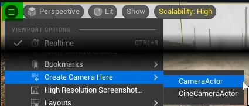
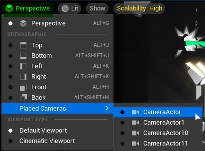

.. _Editor Actor Actions Camera Actor Actions:

====================================================
Camera Actor Actions
====================================================

.. _Editor Actor Actions Camera Actor Place At Viewport Location:

Quickly place camera at current/viewport camera location
============================================================

.. note::
	Custom camera actors are not supported.

|
.. _Editor Actor Actions Camera Actor Switch Between Cameras:

Quickly switch between cameras in current level
===============================================

Placed camera submenu in :guilabel:`View` menu located in viewport, lists all cameras in current level and switches to pilot mode upon activation. 

.. note::

	This does not list cameras being a component of other actor.
	
.. note::

	To make custom actors visible in this menu, it has to be a child of ``CameraActor`` class
