.. _Editor Actor Actions Common:

======================================
Common Actor Operations
======================================

.. admonition:: Assets Used
   :class: seealso
	
    `Underground Subway by SO.Art`_

.. _Underground Subway by SO.Art: https://www.unrealengine.com/marketplace/en-US/product/df77038fa58f4f6faf570f1a133c183a

Place actors
===============================

Drag & Drop from the Content Browser
--------------------------------------

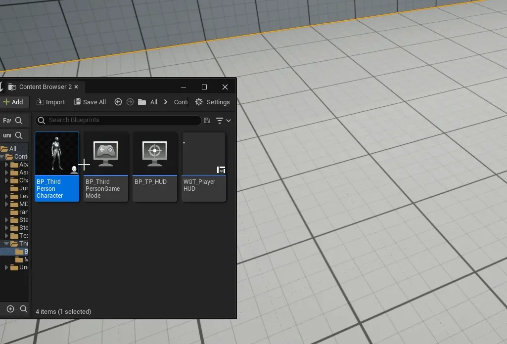

|
Using Context Menu
--------------------------------------

Place Actor submenu in context menu allows rapid placing common and last used actors.

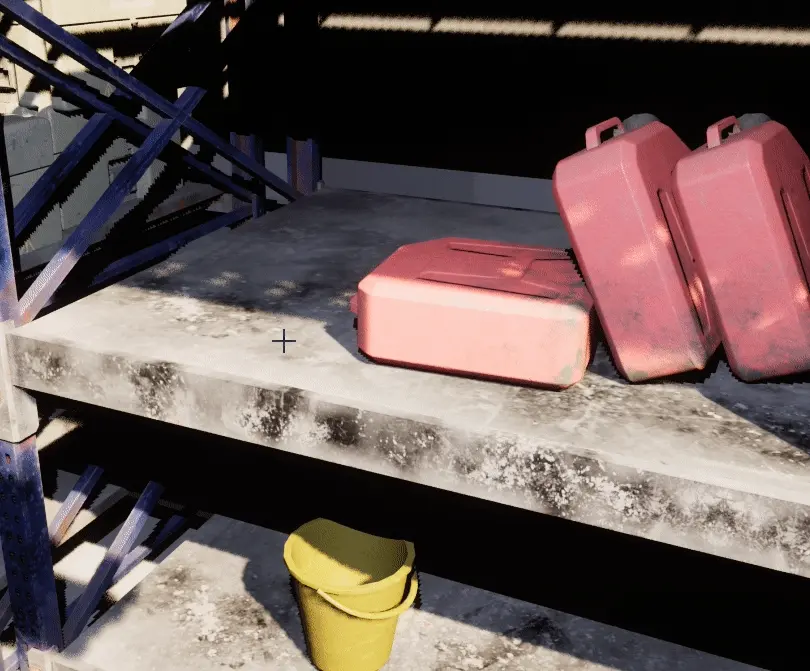

Selection section shows selected actor in asset browser

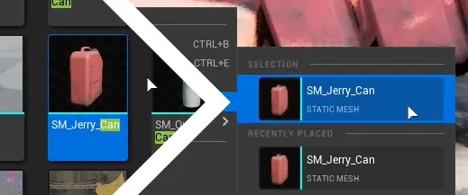

|
Replace actors
===============================

Using Context Menu
--------------------------------------

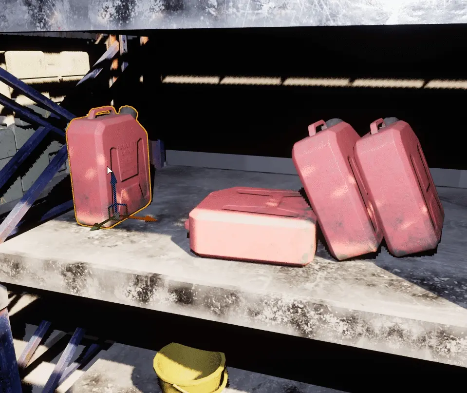

Use ``Replace selected actors with``.

|
Duplicate actors
===============================

:kbd:`Alt` + Drag
-------------------

Press :kbd:`Alt` and drag any gizmo axis to duplicate actor.

.. note::
	
	This feature does not work inside of actor blueprint viewport.

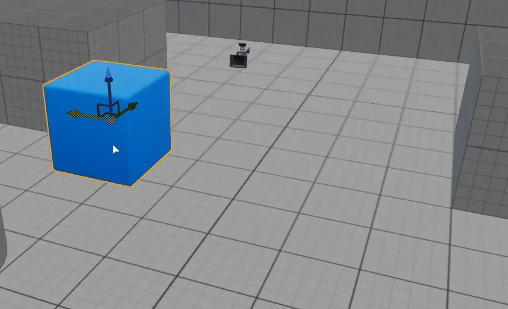

|
Using :kbd:`Ctrl+D` 
------------------------------------------

Press :kbd:`Ctrl+D`  and then drag newly created actor using gizmo, or 

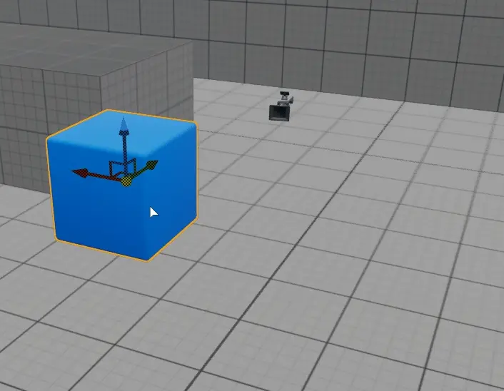
|
Using Context Menu
------------------------------------------

Use :kbd:`Edit` in Context menu.

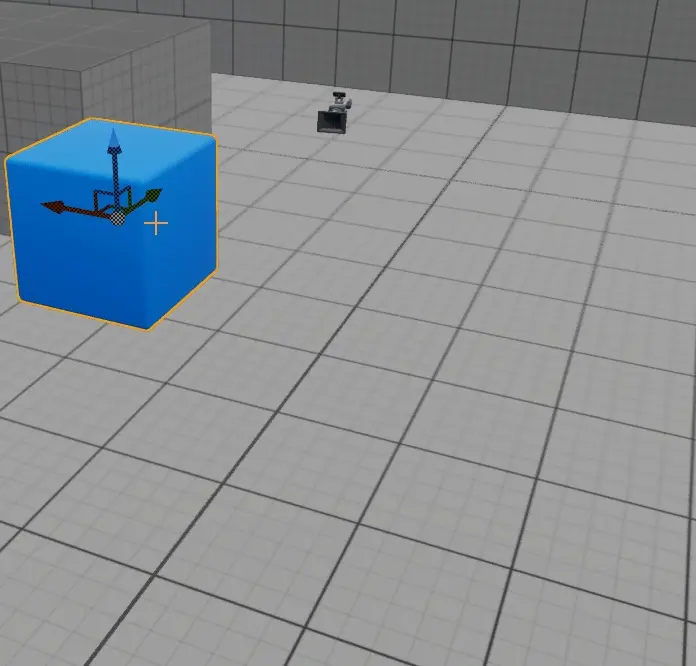
	
|
Using Copy Paste
------------------------------------------

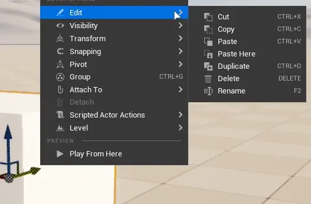

| Keyboard shortcut: :kbd:`CTRL+C` to copy, :kbd:`CTRL+X` to cut, :kbd:`CTRL+V` to paste

|
Using Copy Paste Here
------------------------------------------

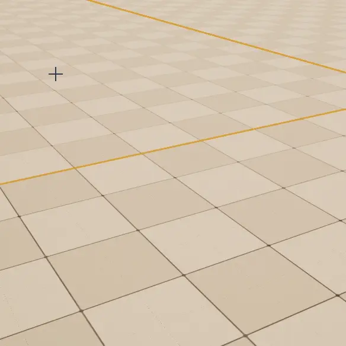

``Paste Here`` function pastes copied actor at click location

|
Selecting Actors
===============================

| Click on the actor to select it.
| Hold :kbd:`Shift` to select multiple actors.
| Press :kbd:`ESC` to deselect all selected actors.

Using outliner
---------------------------------

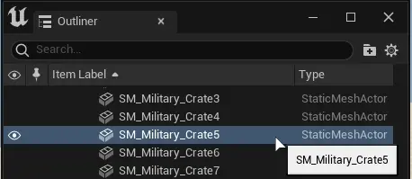
|
Select Transparent/Translucent Actors
-------------------------------------

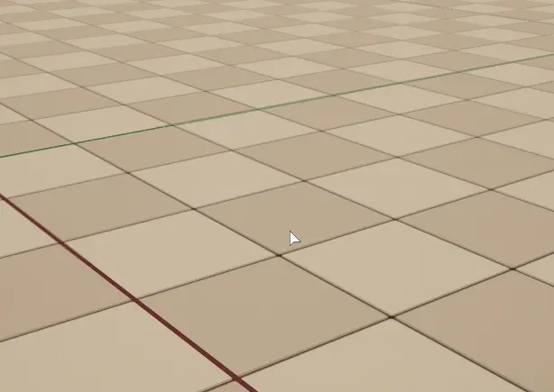

To select transparent/translucent actors, use Settings menu and enable ``Allow Translucent Selection``

| Transparent actors are actors with material that has blend mode set to other than ``Opaque`` or ``Masked``

| This does not include :ref:`bsp_actors`

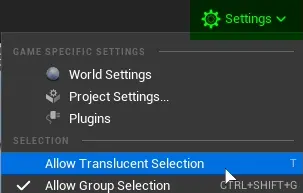

|
Marquee Selection
---------------------------------

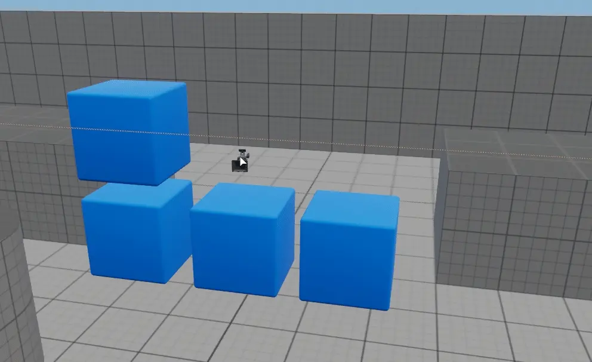

Press :kbd:`CTRL+ALT+LeftMouseButton` and drag to enable marquee selection mode.

Press :kbd:`CTRL+SHIFT+ALT+LeftMouseButton` and drag to add actors to selection using marquee.

|
Strict Box Selection
^^^^^^^^^^^^^^^^^^^^

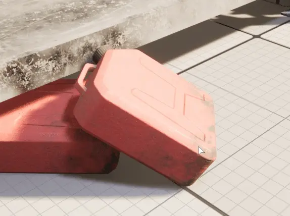

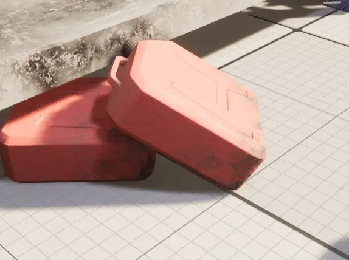

This function enforces that actors selected by marquee selection have to be fully encompassed by the selection rectangle.

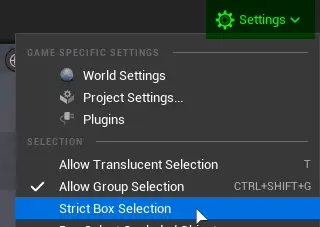
|
Box select Occluded Objects
^^^^^^^^^^^^^^^^^^^^^^^^^^^^

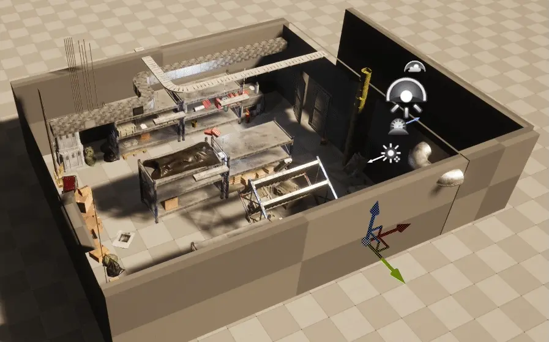

Allows marquee selection to also select objects behind other objects and outside the view.

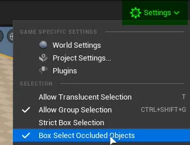

|
Rename Actors
===============================

.. figure:: Common/images/32.webp
    :align: center

Press :kbd:`F2` to rename selected actors. or :kbd:`RightClick` on actor and go in ``Edit`` section in context menu.

.. note::

    You cannot rename multiple actors at once using this method.
|
Change Visibility
===============================

Hide Selected
--------------------

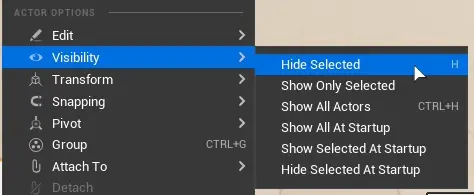

To hide actor in editor, press :kbd:`H`

.. note::

    Once you go into play, simulate mode or switch Levels actors will reappear. 

|
Show Only Selected
--------------------

Use ``Show Only Selected`` to hide everything that is not selected.

.. note::

    This includes lights and sky box.

|
Show/Unhide selected actors
-----------------------------

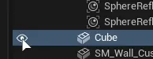

To unhide only selected actors, go to :ref:`editor_outliner`, and click on eye icon

|
Show/Unhide all actors
-----------------------

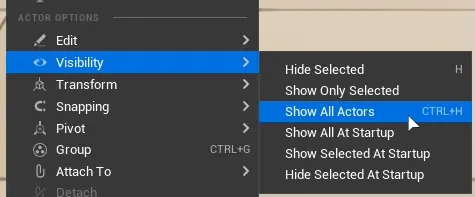

To unhide all hidden actors, press :kbd:`CTRL+H`

.. _show_hide_selected_at_startup:
|
Show/Hide Selected at startup
------------------------------

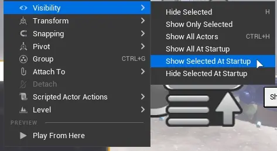

Once editor is in Play or Simulate state, selected actor will unhide/hide.

|
Show all at startup
------------------------------

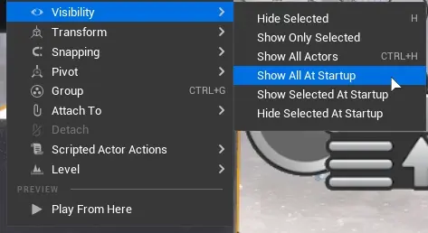

Any actors that had :ref:`show_hide_selected_at_startup` set, this function will reset the state to default.
|
 
.. _actor_groups:

Actor Groups
===============================

Actor groups combine multiple actor instances into one easily movable element in the editor.

Actor Groups cannot be grouped (nested grouping), only merged. :ref:`attaching_actors` feature allows this, not only with single actors but groups too.

|
Create Actor Group
------------------------------

.. figure:: Common/images/12.webp
    :align: center

Actors can be grouped to make moving multiple actors easier.

| Keyboard shortcut: :kbd:`CTRL+G`

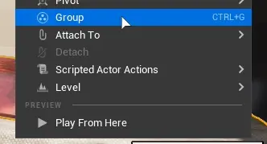

    Context menu entry

|
Adding new actors to group (Regroup)
----------------------------------------

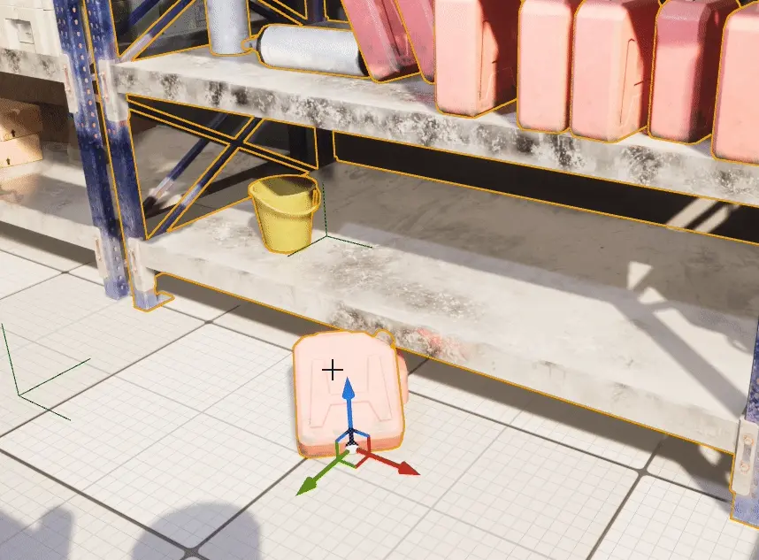

New actors can be added to group anytime using ``Regroup``

| Keyboard shortcut: :kbd:`CTRL+G` while new actor and selected actor group is selected.
|

Unlock Group - Select individual actors in a group
---------------------------------------------------

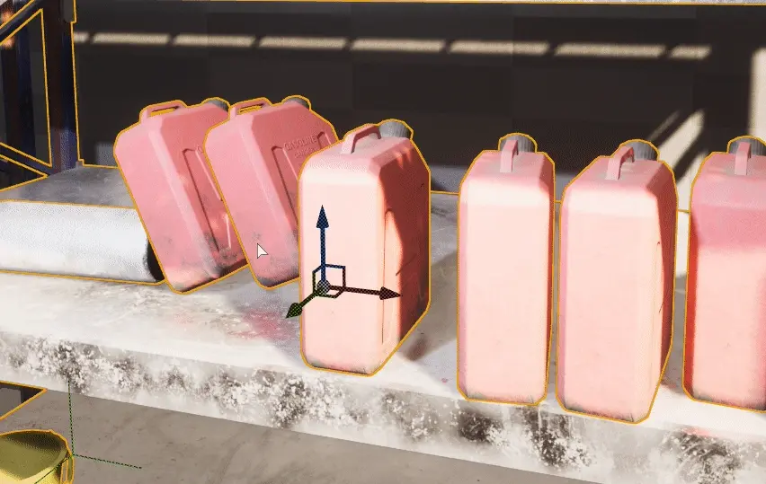

Unlocking group makes individual actors movable again until group is locked again.

|
Ungroup - Remove Group
---------------------------------------------------

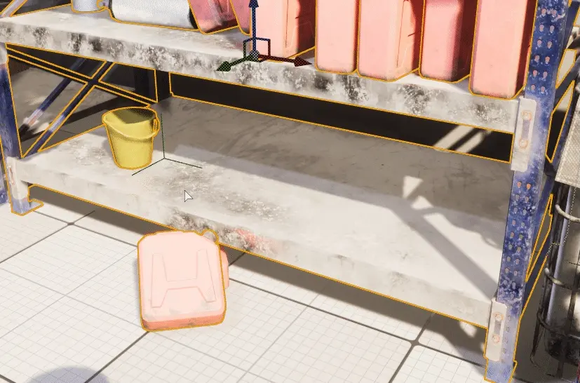

Ungrouping removes the group bond between grouped actors.

|
Allow Group Selection (Unlock all groups toggle)
---------------------------------------------------

``Allow Group Selection`` temporarily disables all groups and group functionality.

| Keyboard shortcut: :kbd:`CTRL+SHIFT+G`

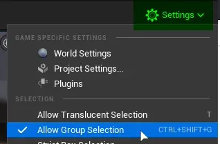

|
Removing all actors in a group
---------------------------------------------------

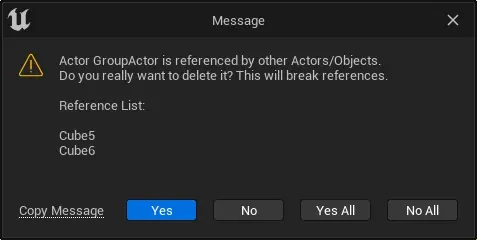

Upon pressing delete on a group, all actors being a part of this group are deleted. Warning message will be shown 

.. _attaching_actors:

Attaching Actors
===============================

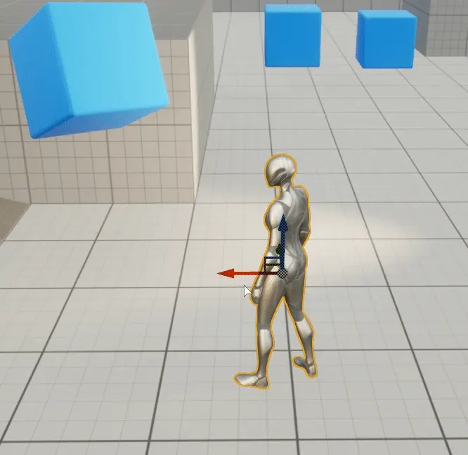

If you want to other actor copy transforms (location, rotation and scale) of other actor, but not be a component of it or in a group use ``Attach To`` from actor context menu.

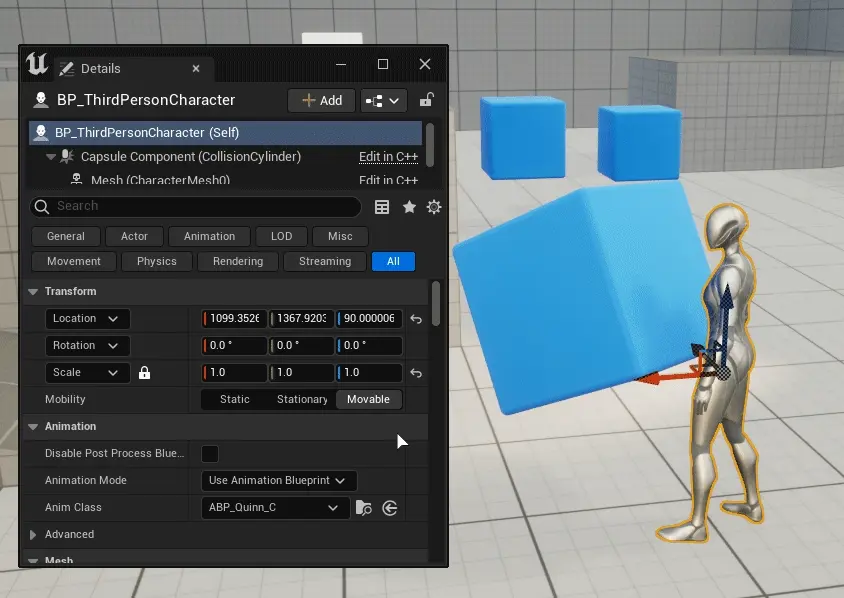

    It does not change scale of objects upon attaching, but after being attached it scales with parent actor.

Attached actors will be visible in :ref:`outliner` hierarchy

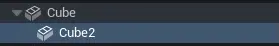

After parent actor deletion, child actors are simply detached.

Unlike :ref:`actor_groups`, child actors can have other child actors attached to them and even whole groups.

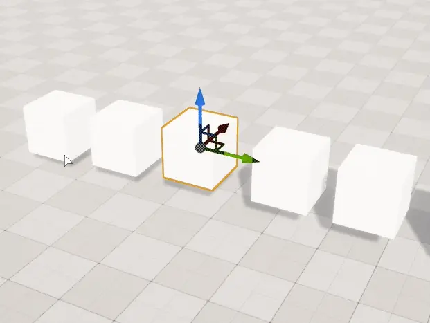