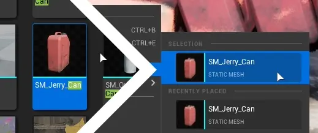
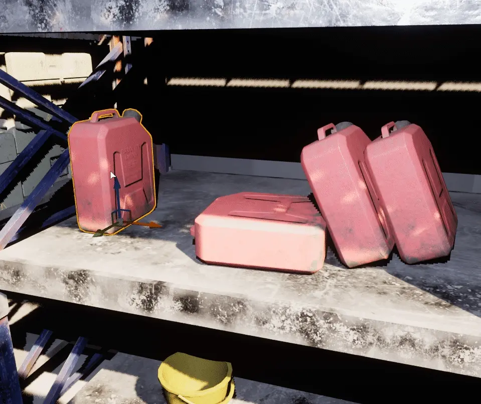
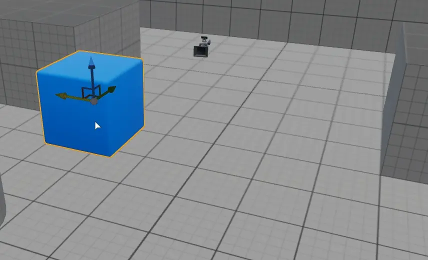
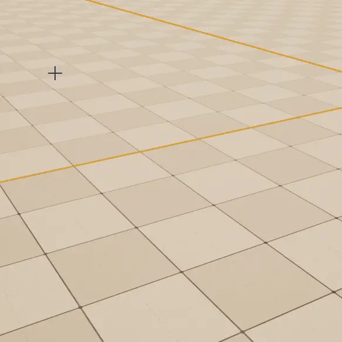
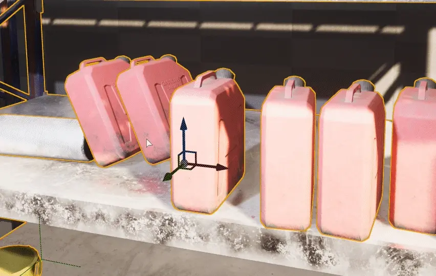
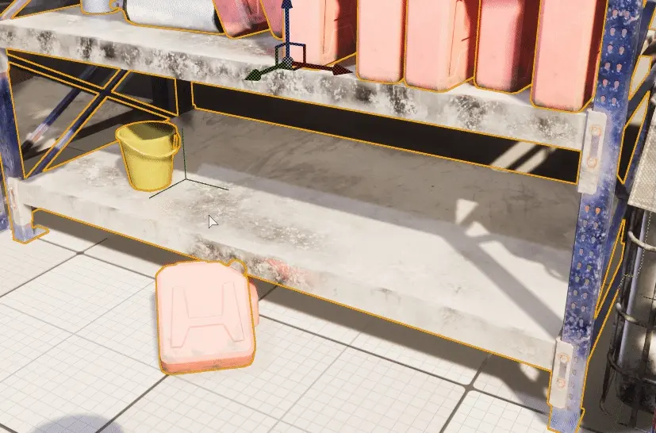
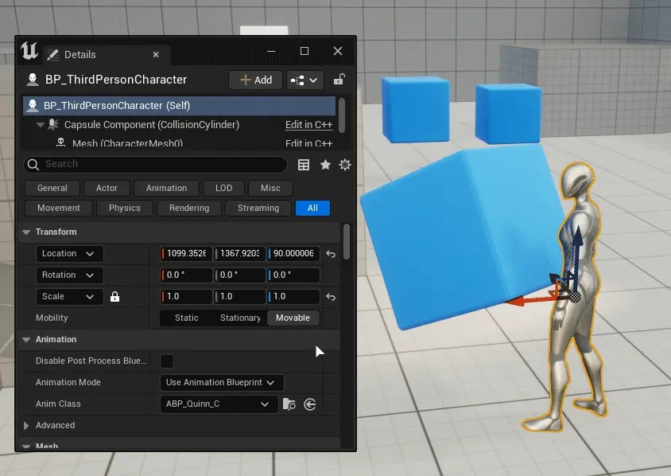

======================================
Common Actor Operations
======================================

.. admonition:: See also
   :class: seealso

	Assets used in creation of animations are a part of:
	
	* `Underground Subway by SO.Art`_

.. _Underground Subway by SO.Art: https://www.unrealengine.com/marketplace/en-US/product/df77038fa58f4f6faf570f1a133c183a

Place actors
===============================

Drag & Drop from the Content Browser
--------------------------------------

.. figure:: images/24.webp
    :align: center

Using Context Menu
--------------------------------------

Place Actor submenu in context menu allows rapid placing common and last used actors.

.. figure:: images/05.webp
    :align: center

Selection section shows selected actor in asset browser

Replace actors
===============================

Using Context Menu
--------------------------------------

``Replace selected actors with`` does exactly that.

Duplicate actors
===============================

:kbd:`Alt` + Drag
-------------------

Press :kbd:`Alt` and drag any gizmo axis to duplicate actor.

.. note::
	
	This feature does not work inside of actor blueprint viewport.

Using :kbd:`Ctrl+D` 
------------------------------------------

Press :kbd:`Ctrl+D`  and then drag newly created actor using gizmo, or 

.. figure:: images/03.webp
    :align: center

Using Context Menu
------------------------------------------

Use :kbd:`Edit` in Context menu.

.. figure:: images/04.webp
    :align: center
	

Using Copy Paste
------------------------------------------

.. figure:: images/30.webp
    :align: center

| Keyboard shortcut: :kbd:`CTRL+C` to copy, :kbd:`CTRL+X` to cut, :kbd:`CTRL+V` to paste

There is an extra feature, ``Paste Here`` which pastes copied actor at click location

Selecting Actors
===============================

| Click on the actor to select it.
| Hold :kbd:`Shift` to select multiple actors.
| Press :kbd:`ESC` to deselect all selected actors.

Using outliner
---------------------------------

.. figure:: images/09.webp
    :align: center

Select Transparent/Translucent Actors
-------------------------------------

.. figure:: images/11.webp
    :align: center

To select transparent/translucent actors, use Settings menu and enable ``Allow Translucent Selection``

| Transparent actors are actors with material that has blend mode set to other than ``Opaque`` or ``Masked``

| This does not include :ref:`bsp_actors`

.. figure:: images/10.webp
    :align: center

Marquee Selection
---------------------------------
Press :kbd:`CTRL+ALT+LeftMouseButton` and drag to enable marquee selection mode.

Press :kbd:`CTRL+SHIFT+ALT+LeftMouseButton` and drag to add actors to selection using marquee.

.. figure:: images/01.webp
    :align: center

Strict Box Selection
^^^^^^^^^^^^^^^^^^^^

.. image:: images/19.webp
    :width: 47%

.. image:: images/20.webp
    :width: 47%

This function enforces that actors selected by marquee selection have to be fully encompassed by the selection rectangle.

.. figure:: images/18.webp
    :align: center

Box select Occluded Objects
^^^^^^^^^^^^^^^^^^^^^^^^^^^^

.. image:: images/21.webp
    :width: 47%

.. image:: images/22.webp
    :width: 47%

Allows marquee selection to also select objects behind other objects and outside the view.

.. figure:: images/23.webp
    :align: center

Rename Actors
===============================

.. figure:: images/32.webp
    :align: center

Press :kbd:`F2` to rename selected actors. or :kbd:`RightClick` on actor and go in ``Edit`` section in context menu.

.. note::

    You cannot rename multiple actors at once using this method.

Change Visibility
===============================

Hide Selected
--------------------

.. figure:: images/33.webp
    :align: center

To hide actor in editor, press :kbd:`H`

.. note::

    Once you go into play, simulate mode or switch Levels actors will reappear. 

Alternatively use ``Show Only Selected`` to hide everything else.

.. note::

    This includes lights and sky box.

Show/Unhide selected actors
-----------------------------

.. figure:: images/34.webp
    :align: center

To unhide only selected actors, go to :ref:`editor_outliner`, and click on eye icon

Show/Unhide all actors
-----------------------

.. figure:: images/35.webp
    :align: center

To unhide all hidden actors, press :kbd:`CTRL+H`

.. _show_hide_selected_at_startup:

Show/Hide Selected at startup
------------------------------

.. figure:: images/37.webp
    :align: center

Once editor is in Play or Simulate state, selected actor will unhide/hide.

Show all at startup
------------------------------

.. figure:: images/36.webp
    :align: center

Any actors that had :ref:`show_hide_selected_at_startup` set, this function will reset the state to default.

.. _actor_groups:

Actor Groups
===============================

.. figure:: images/12.webp
    :align: center

Actors can be grouped to make moving multiple actors easier.

| Keyboard shortcut: :kbd:`CTRL+G`

.. figure:: images/13.webp
    :align: center

    Grouping using context menu

New actors can be added to group anytime using ``Regroup``

| Keyboard shortcut: :kbd:`CTRL+G` while new actor and selected actor group is selected.

.. figure:: images/15.webp
    :align: center

Unlocking group makes individual actors movable again until group is locked again.

Ungrouping removes the group bond between grouped actors.

``Allow Group Selection`` temporarily disables all groups and group functionality.

| Keyboard shortcut: :kbd:`CTRL+SHIFT+G`

.. figure:: images/17.webp
    :align: center

Upon pressing delete on a group, all actors being a part of this group are deleted. Warning message will be shown 

.. figure:: images/28.webp
    :align: center

Actor Groups cannot be grouped, only merged. :ref:`attaching_actors` feature allows this, not only with single actors but groups too.

.. _attaching_actors:

Attaching Actors
===============================

.. figure:: images/25.webp
    :align: center

If you want to other actor copy transforms (location, rotation and scale) of other actor, but not be a component of it or in a group use ``Attach To`` from actor context menu.

    It does not change scale of objects upon attaching, but after being attached it scales with parent actor.

Attached actors will be visible in :ref:`outliner` hierarchy

.. figure:: images/27.webp
    :align: center

Upon parent actor deletion, child actors are simply detached.

Unlike :ref:`actor_groups`, child actors can have other child actors attached to them and even whole groups.

.. figure:: images/29.webp
    :align: center