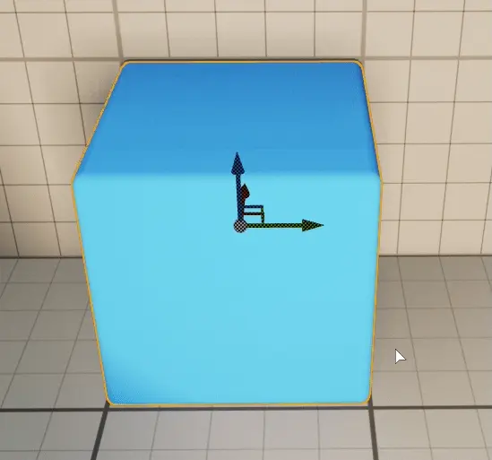
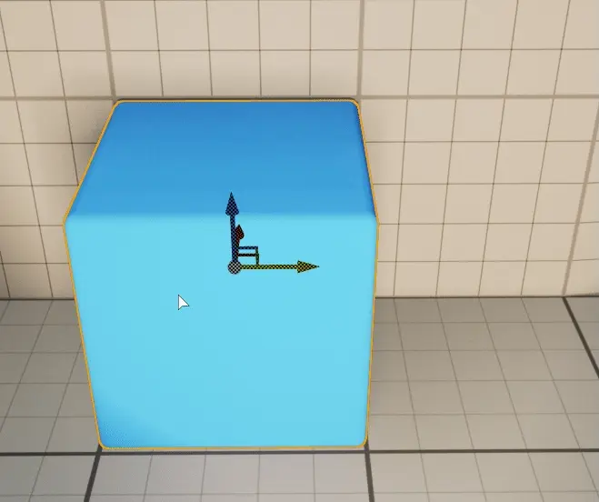
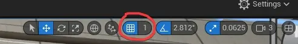
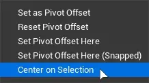
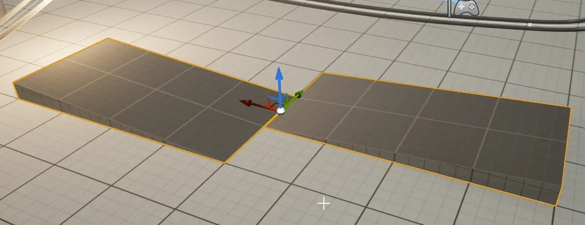
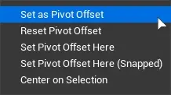

.. _actor_pivot_offset:

============================================
Actor pivot offset (Move 3D gizmo)
============================================

.. image:: Pivot/images/07.webp
	:align: center

Use pivot offset if it's difficult to place or rotate actor to your target translation. 

|

Temporary pivot point change
=====================================================================

Drag the pivot manually
------------------------

Hover mouse cursor over the gizmo and press :kbd:`LeftAlt+MiddleMouseButton` and drag it.

|
.. _actor_pivot_to_cursor_pos:

Set pivot to mouse cursor location
------------------------------------

Select one or more actors and place your cursor where you wish to place your pivot point, open context menu (``[Right Mouse Button]``) and select ``Pivot > Set Pivot Offset Here``

``Set Pivot Point Here (Snapped)`` is going to place it snapped to nearest grid point.
Grid snapping can be configured in the upper right corner of the viewport.

|
Center pivot between multiple actors
--------------------------------------------------------------
	
``Center on Selection`` will set the pivot point in the center of all selected actors.

.. note::
	Center is measured from **default** pivot points. 

|
Make pivot offset permament 
=====================================================================

Pivot point changes are temporary. To make Unreal Engine remember your custom settings, set custom pivot offset and select ``Set as Pivot Offset``.

You can always reset it to default, using ``Reset Pivot Offset``.

.. note::
	These changes are only applied to selected actor instances. 
