===================================================
Translating actors in the world
===================================================

Actor Translation Modes
========================

Mode can be switched using 

1. Buttons on the top right of the viewport.

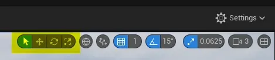

2. Using keyboard shortcuts. Hovering over buttons reveals keyboard shortcut in popup bubble. Key shortcuts are quite easy to remember as they are first letters on QWERTY keyboard. Autodesk Maya uses the same layout.

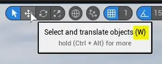
    

.. table:: 
    :width: 100%

    +---------------+---------------+---------------------------------------+
    |Mode           | Shortcut Key  | Preview                               |
    +===============+===============+=======================================+
    |Select         | :kbd:`Q`      | .. image:: Translating/images/03.webp |
    |               |               |   :align: center                      |
    |               |               |   :width: 250px                       |
    +---------------+---------------+---------------------------------------+
    |Move           | :kbd:`W`      | .. image:: Translating/images/04.webp |
    |               |               |   :align: center                      |
    |               |               |   :width: 250px                       |
    +---------------+---------------+---------------------------------------+
    |Rotate         | :kbd:`E`      | .. image:: Translating/images/05.webp |
    |               |               |   :align: center                      |
    |               |               |   :width: 250px                       |
    +---------------+---------------+---------------------------------------+
    |Scale          | :kbd:`R`      | .. image:: Translating/images/06.webp |
    |               |               |   :align: center                      |
    |               |               |   :width: 250px                       |
    +---------------+---------------+---------------------------------------+

Using gizmo
========================

Clicking on any actor is going to show manipulator - gizmo, allowing user to move, rotate or scale it, depending on mode selected.
All actions are applied from the pivot point, that is set in blueprint editor or in other DCC software (like blender) eg. for static meshes.

Gizmo can be moved without moving the actor to make manipulations easier. See :ref:`actor_pivot_offset`

Move and scale
-------------------

Clicking and dragging on single axis will manipulate actor in single axis.

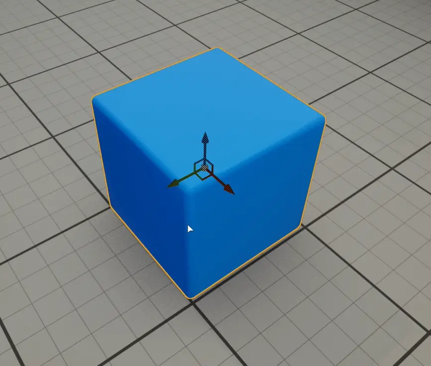

Clicking and dragging on section in between two axis will lock manipulations to these two axis

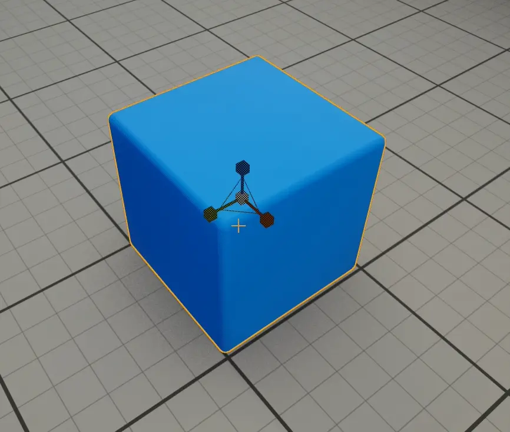

Clicking and dragging on white ball in the center will manipulate actor in all axis.

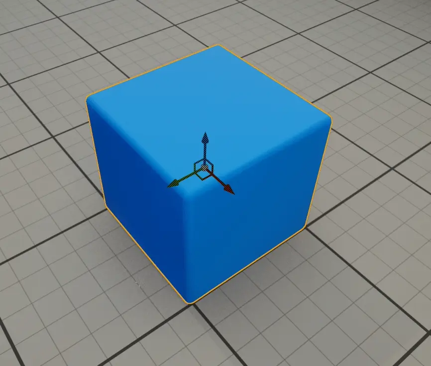
    
For scale transforming exclusively, holding :kbd:`CTRL` and dragging any single axis will scale actor in all axis.

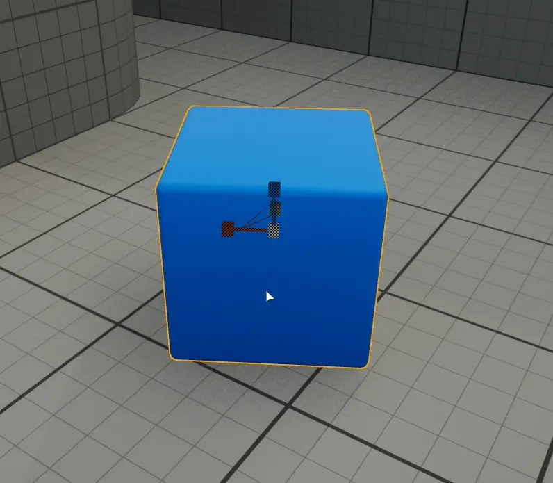

Rotate
----------------------
By default Unreal Engine allows only explicit axis rotation using gizmo.

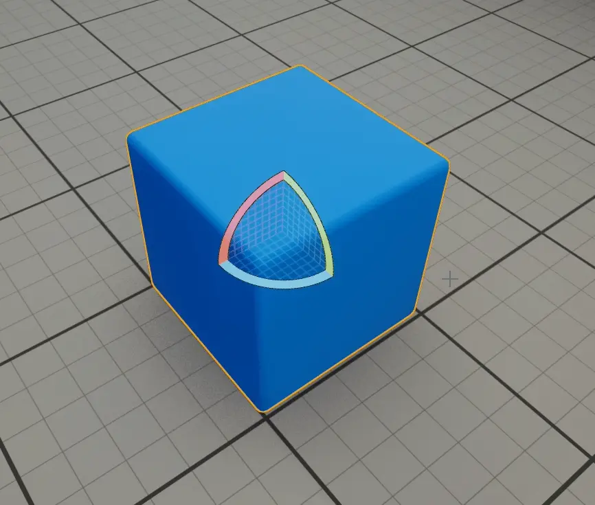

Free rotation gizmo (Arcball Rotate) can be enabled in :menuselection:`Edit --> Editor Preferences`. Search for ``arcball`` or go to :menuselection:`Level Editor --> Viewports --> Look And Feel`

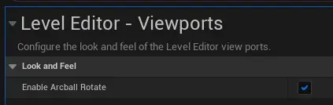

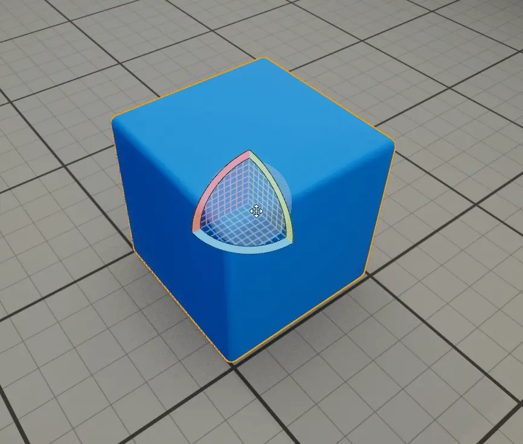
    
    Arcball Rotate in action

Using Details Panel
========================

It's also possible to manipulate selected actor's translation using Details Panel, explicitly setting values or clickning and dragging.

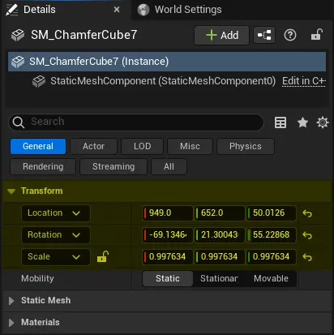
    
.. note::
    
    There is no value snapping to fractions while dragging (0.1, 1, 10, ...) in Unreal Engine

Details panel also allows locking of scale axis - actor will always be scaled uniformly, in all axis.

.. figure:: Translating/images/14.webp
    :align: center
    :width: 50%
    

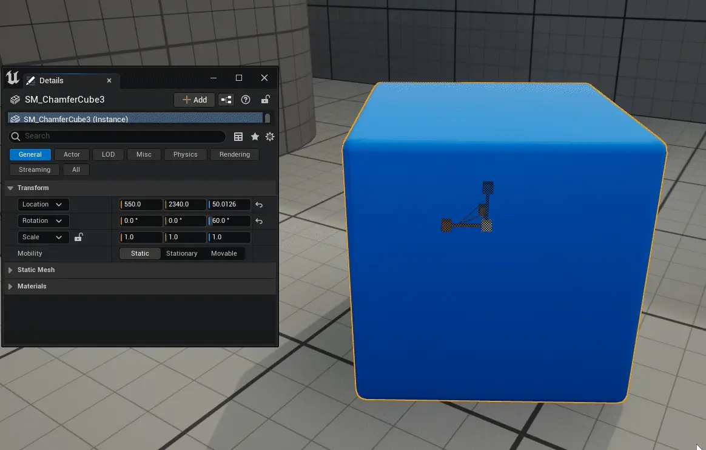
    
    Scaling using details panel
   
.. note:: 

    This only works when typing in values or dragging any scale axis in details panel. Scaling using gizmo ignores this lock.
    To scale uniformly using gizmo, hold :kbd:`CTRL` while dragging any single gizmo axis.

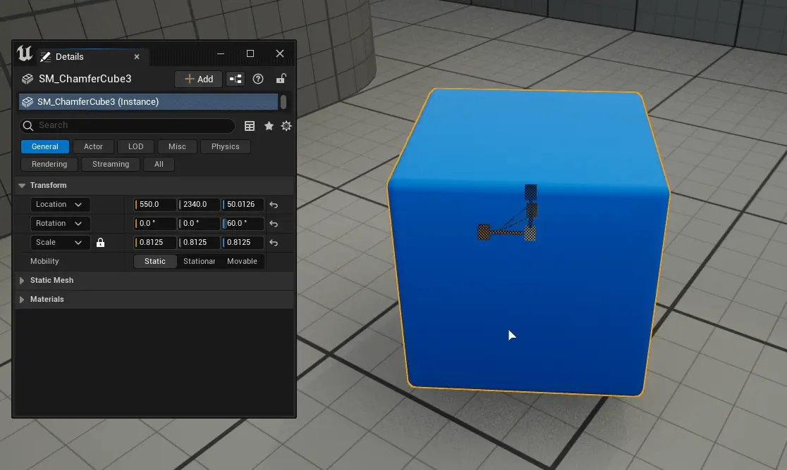
    
    Scaling using gizmo and then details panel with lock

Moving actor using WASD keys
=================================

To move actor using WASD keys, use Pilot option from context menu. or press :kbd:`CTRL+SHIFT+P`

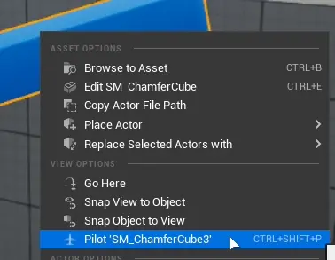

.. note::

	Gizmo position (pivot point) won't move while using this feature. Simply reselect actor to put it into correct position.

To stop simply press eject button in the left upper corner of the viewport.

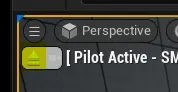

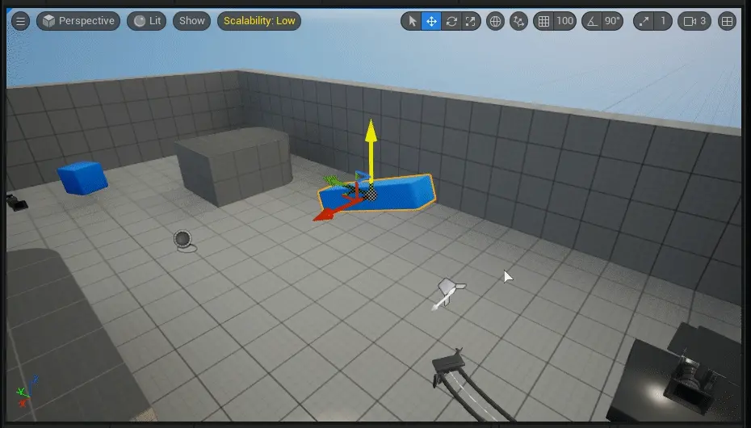
    
    Pilot actor feature in action.
	
Toggle camera feature
^^^^^^^^^^^^^^^^^^^^^^^^^

If the actor that is used in Pilot function has a camera component, this feature toggles between automatic camera and component.

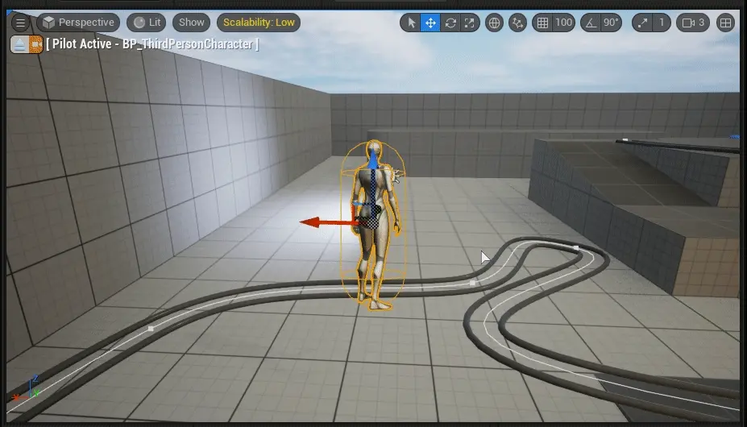

If actor has multiple cameras, the lowest camera in components view will be used.

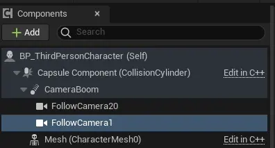
	
    FollowCamera1 will be used for this feature.

Actor Transform Context Menu
==============================

Delta Transform
--------------------------

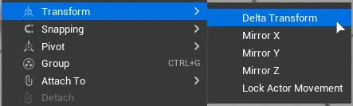

Simply add or subtract position values to/from current position.

| Unit is centimeters

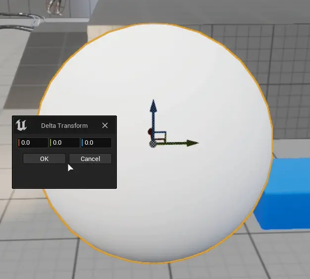

Mirror X/Y/Z
--------------------------

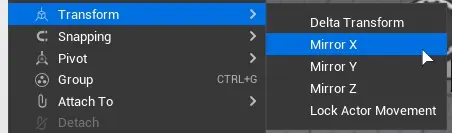

Simply multiply X/Y/Z scale value by (-1)

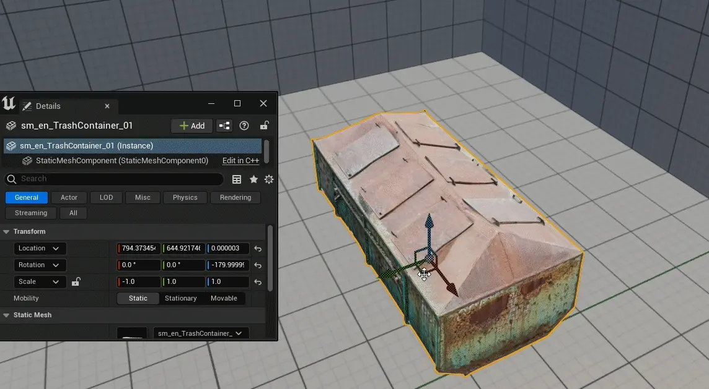

Lock actor movement
--------------------------

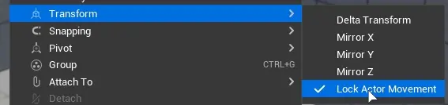

Blocks all actor instance movements, scaling and rotation.

| This can be quite useful while tweaking camera actor settings, keeping it in place.

.. note::

    Actors can still be scaled inside of blueprint, this is editor viewport only setting.

.. note::

    Title is slightly misleading, this locks all transforms including rotation and scaling.

.. note::

    3D Gizmo might not be visible while this option is enabled.

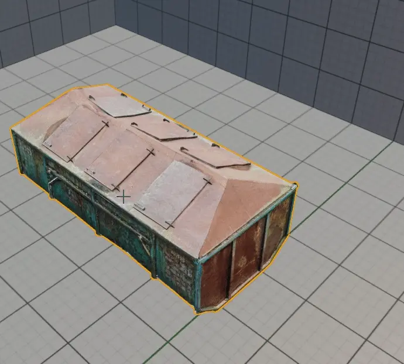

Local and Global coordinate system
===================================

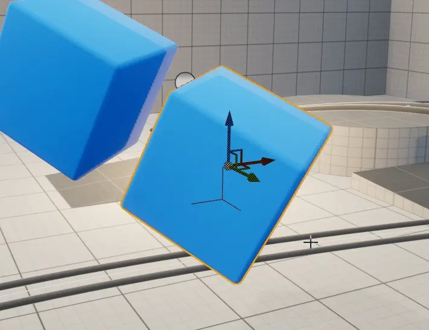

You can switch between local and world coordinate system for 3D Gizmo using button located in viewport toolbar.

This comes quite handy for objects that are rotated.

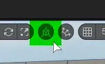