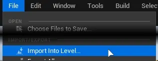
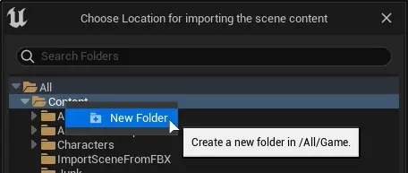

.. _Importing Assets:

.. toctree::
    :hidden:
    :glob:

    Importing/*

==========================
Importing Assets
==========================

.. _Importing Assets Import Into Level:

Import Into Level
=======================

To import whole scenes and place them into the level, use ``Import Into Level``

.. admonition:: Warning
    :class: caution

    Only ``FBX``, ``GLTF``, ``GLB`` and ``MTLX`` formats are supported by this function.

.. admonition:: Warning
    :class: caution

    Using this method will create a single .uasset file in project directory, instead of many separate ones.

After selecting source file all other windows won't be interactible. To create a new folder, right click on parent folder.

Depending on source file format, appropriate importing window will show up.

