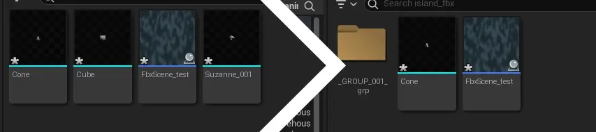
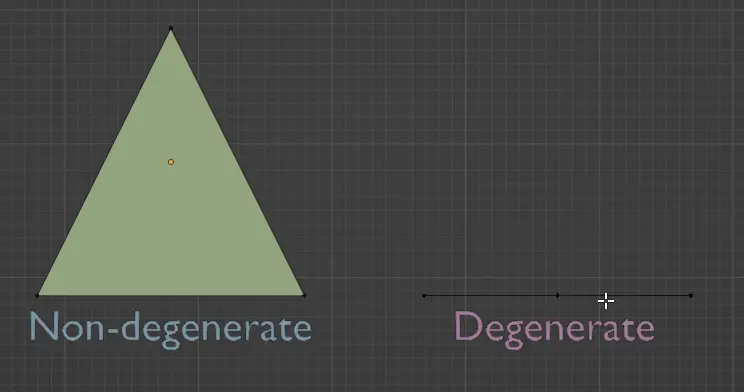
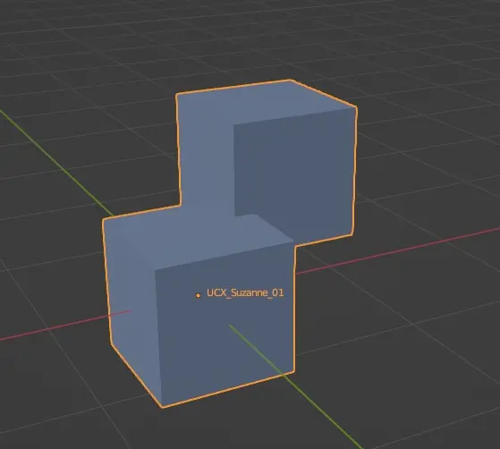
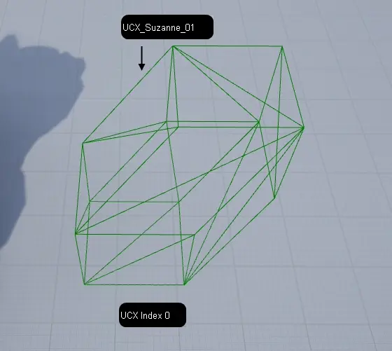
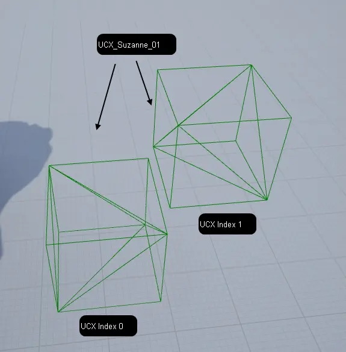

.. _Importing Assets Common Options:

========================================
Common Importing Assets options
========================================

.. _Create Content Folder Hierarchy:

Create Content Folder Hierarchy
'''''''''''''''''''''''''''''''''

If assets are grouped or parented, this feature will place those assets in separate folders with same name as group/parent name.

Shared/Linked assets will be placed inside of folder containing first asset in hierarchy that uses it.

.. note ::
    Assets used in this example: 
    
    * `ISLAND by Stéphane Agullo is licensed under Creative Commons Attribution <https://sketchfab.com/3d-models/island-80036f71b0014f0fbae6732d2465b64d>`_

.. _Import as Dynamic:

Import as Dynamic
'''''''''''''''''''''''''''''''''
Simply sets :ref:`actor mobility <Actor Mobility>` of all imported actors to dynamic, instead of static.

.. _Hierarchy Type:

Hierarchy type
'''''''''''''''''''''''''''''''''
* Create one Blueprint Asset

    Imported assets will be added to a single blueprint that will be placed in current level. Groups will be converted into scene components.

.. |ht_img0| figure:: images/06.webp
    :align: center

* Create one Actor with components

    Imported assets will be added to single actor in level, **without a blueprint**. 
    
    Actor containing assets will not be shown in asset browser. Assets themselves, will be shown.

* Create Level actors

    Imported assets will be added to level as separate actors. Actors will be automatically attached to parents, if applicable. See :ref:`Attach Actor`

.. _Force Front XAxis:

Force Front XAxis
-------------------------------

If your assets are front towards X axis instead of Y- select this option.

.. note ::

    While exporting from blender, it looks like it should be aligned towards X- not X axis while this is enabled.

.. _Bake Pivot in Vertex:

Bake Pivot in Vertex
-------------------------------

Makes pivot point saved in source file being

.. note::

    Does not apply for Blender users as Blender already does that while exporting FBX file.

.. _Import Static Mesh LOD:

Import Static Mesh LOD
----------------------------

Self explanatory. See :ref:`Creating Static Mesh LOD`

Disabled = Only import LOD0

.. _Import Skeletal Mesh LOD:

Import Skeletal Mesh LOD
----------------------------

Self explanatory. See :ref:`Creating Skeletal Mesh LOD`

Disabled = Only import LOD0

.. _LevelImport Invert Normal Maps:

Invert Normal Maps
----------------------

If your materials contain OpenGL type Normal Maps, use this option to automatically convert them to DirectX format.
See :ref:`Normal Maps`

.. _ImportToLevel Generate Missing Collision:

Generate Missing Collision
------------------------------

If any asset inside of FBX file do not have custom collsion, this feature will generate it.

This does not override custom collision. See :ref:`Creating Custom Asset Collision`

.. _ImportToLevel Vertex Color Import Option:

Vertex Color Import Option
----------------------------

* **Replace** - Simply imports Vertex Colors set in FBX file.
* **Ignore** - Does not import vertex colors set in FBX file
* **Override** - Sets vertex color to all verticles to color specified in :ref:`ImportToLevel Vertex Override Color`

.. _ImportToLevel Vertex Override Color:

Vertex Override Color
----------------------------

If :ref:`Vertex Color Import Option` is set to override, this defines what Vertex Color to set to all verticles

.. _ImportToLevel Remove Degenerates:

Remove Degenerates
----------------------------

This feature removes all degenerate triangles. (triangles that are so much squashed that they became a line)

.. _ImportToLevel Build Reversed Index Buffer:

Build Reversed Index Buffer
----------------------------

[TODO] ? Reversed index buffer, used to prevent changing culling state between drawcalls.
? disable Reverse index buffer if you are never inverting your mesh by scaling negatively.

.. _ImportToLevel Generate Lightmap UVs:

Generate Lightmap UVs
----------------------------

Generates an UVMap for Lightmap (baked lightning). New UVMap will have index of [last UVMap index in source file]+1.

See :ref:`Creating Lightmap UVs`

.. _ImportToLevel One Convex Hull per UCX:

One Convex Hull per UCX
----------------------------

If a single custom collision object consists of multiple floating meshes, this option merges them into a single convex hull.

Leaving this option unticked, Unreal Engine will split it into multiple collision meshes, the same way as if it would be separated in blender/maya/... as UCX_Mesh_01 and UCX_Mesh_02

| It does **not** merge other collision objects into one 
| (eg. UCX_Mesh_01 and UCX_Mesh_02 manually created in Blender/Maya/... will not be merged into one)

.. _ImportToLevel Import Normal Method:

Import Normal Method
---------------------------

* **Compute Normals** - Ignores normals stored in FBX file and generates new data.
* **Import Normals** - Imports normal data from FBX file but generates tangents and binormals data
* **Import Normals and Tangents** - Imports both normals, tangents and binormals from FBX file.

.. _ImportToLevel Normal Generation Method:

Normal Generation Method
---------------------------

If :ref:`ImportToLevel Import Normal Method` is not set to ``Import Normals and Tangents``, generates new normal data using selected alghoritm.

[TODO]

.. _FbxSceneImportData :

FbxSceneImportData 
---------------------------

FbxSceneImportData asset purpose is to provide functionality of reimporting, adding and removing assets from single FBX file.

.. note::
    
    If :ref:`Create Content Folder Hierarchy` was checked, new folders might not show up in asset browser on reimporting.
    
    Creating these folders manually, using :ref:`Save All` or restarting editor will fix the issue.

.. note::

    If :ref:`Create Content Folder Hierarchy` was checked, assets might temporarily be visible in asset browser as if this option was unchecked. Refreshing asset browser will fix the issue.

.. _gltf Import Offset Translation:

Offset Translation
----------------------

Add or subtract world position of ``Scene`` actor that imported assets from source file will be set to be a child of.

.. note::

    Meshes will be imported as normal, without those changes in their blueprints.

    .. figure:: images/24.webp
        :align: center

.. _gltf Import Offset Rotation:

Offset Rotation
----------------------

Add or subtract world rotation of ``Scene`` actor that imported assets from source file will be set to be a child of.

.. note::

    Meshes will be imported as normal, without those changes in their blueprints.

    .. figure:: images/24.webp
        :align: center

.. _gltf Import Offset Uniform Scale:

Offset Uniform Scale
----------------------

Set world scale multiplier of ``Scene`` actor that imported assets from source file will be set to be a child of.

.. note::

    Meshes will be imported as normal, without those changes in their blueprints.

    .. figure:: images/24.webp
        :align: center

.. _gltf Import Force All Mesh as Type:

Force All Mesh as Type
----------------------

Forces all meshes from file to be converted into static or skeletal mesh assets.

.. _gltf Import Import Lods:

Import Lods
----------------------

Whether to import :ref:`LODs <Creating LODs>` of static and skeletal meshes.

.. _gltf Import Vertex Color Import Option:

Vertex Color Import Option
--------------------------------------------

* **Replace** - Imports Vertex Colors for new meshes or replaces them when reimporting
* **Ignore** - Does not import Vertex Colors or does not replace them when Reimporting
* **Override** - Sets new Vertex Color to all verticles with values set in :ref:`gltf Import Vertex Override Color`

.. _gltf Import Vertex Override Color:

Vertex Override Color
--------------------------------------------

Sets new Vertex Color to all verticles using provided value.

.. _gltf Import Recompute Normals:

Recompute Normals
----------------------

.. _gltf Import Recompute Tangents:

Recompute Tangents
----------------------

.. _gltf Import Use Mikk TSpace:

Use Mikk TSpace
----------------------

.. _gltf Import Compute Weighted Normals:

Compute Weighted Normals
--------------------------------------------

.. _gltf Import Use High Precision Tangent Basis:

Use High Precision Tangent Basis
--------------------------------------------

.. _gltf Import Use Full Precision UVs:

Use Full Precision UVs
--------------------------------------------

.. _gltf Import Use Backwards Compatible F16Trunc UVs:

Use Backwards Compatible F16Trunc UVs
--------------------------------------------

.. _gltf Import Remove Degenerates:

Remove Degenerates
--------------------------------------------

.. _gltf Import Import Meshes In Bone Hierarchy:

Meshes In Bone Hierarchy
----------------------

.. _gltf Import Use T0As Ref Pose:

Use T0As Ref Pose
----------------------

.. _gltf Import Import Animations:

Import Animations
----------------------

.. _gltf Import Import Bone Tracks:

Import Bone Tracks
----------------------

.. _gltf Import Animation Length:

Animation Length
----------------------

.. _gltf Import Frame Import Range:

Frame Import Range
----------------------

.. _gltf Import Use 30Hz to Bake Bone Animation:

Use 30Hz to Bake Bone Animation
--------------------------------------------

.. _gltf Import Custom Bone Animation Sample Rate:

Custom Bone Animation Sample Rate
--------------------------------------------

.. _gltf Import Snap To Closest Frame Boundary:

Snap To Closest Frame Boundary
------------------------------------------------------------------

.. _gltf Import Import Attributes as Curves or Animation Attributes:

Import Attributes as Curves or Animation Attributes
------------------------------------------------------------------

.. _gltf Import Set Material Curve Type:

Set Material Curve Type
--------------------------------------------

.. _gltf Import Material Curve Suffixes:

Material Curve Suffixes
--------------------------------------------

.. _gltf Import Remove Redundant Keys:

Remove Redundant Keys
----------------------

.. _gltf Import Do not import curves with only 0 values:

Do not import curves with only 0 values
--------------------------------------------

.. _gltf Import Delete Existing Animation Attributes:

Delete Existing Animation Attributes
--------------------------------------------

.. _gltf Import Delete Existing Animation Curves:

Delete Existing Animation Curves
------------------------------------------------------------------

.. _gltf Import Delete Existing Morph Target Curves:

Delete Existing Morph Target Curves
--------------------------------------------

.. _gltf Import Import Materials:

Import Materials
----------------------

.. _gltf Import Material Import:

Material Import
--------------------------------------------

.. _gltf Import Parent Material:

Parent Material
----------------------

.. _gltf Import Import Skeletal Meshes:

Import Skeletal Meshes
--------------------------------------------

.. _gltf Import Import Content Type:

Import Content Type
--------------------------------------------

.. _gltf Import Import Morph Targets:

Import Morph Targets
----------------------

.. _gltf Import Update Skeleton Reference Pose:

Update Skeleton Reference Pose
--------------------------------------------

.. _gltf Import Create Physics Asset:

Create Physics Asset
--------------------------------------------

.. _gltf Import Threshold Position:

Threshold Position
----------------------

.. _gltf Import Threshold Tangent Normal:

Threshold Tangent Normal
--------------------------------------------

.. _gltf Import Threshold UV:

Threshold UV
--------------------------------------------

.. _gltf Import Morph Threshold Position:

Morph Threshold Position
--------------------------------------------

.. _gltf Import Import Static Meshes:

Import Static Meshes
--------------------------------------------

.. _gltf Import Import Collision According To Mesh Name:

Import Collision According To Mesh Name
--------------------------------------------

.. _gltf Import One Conves Hull Per UCX:

One Conves Hull Per UCX
--------------------------------------------

.. _gltf Import Build Nanite:

Build Nanite
----------------------

.. _gltf Import Build Reversed Index Buffer:

Build Reversed Index Buffer
--------------------------------------------

.. _gltf Import Generate Lightmap UVs:

Generate Lightmap UVs
----------------------

.. _gltf Import Two Sided Disatnce Field Generation:

Two Sided Disatnce Field Generation
--------------------------------------------

.. _gltf Import Enable Physical Material Mask:

Enable Physical Material Mask
--------------------------------------------

.. _gltf Import Min Lightmap Resolution:

Min Lightmap Resolution
--------------------------------------------

.. _gltf Import Source Lightmap Index:

Source Lightmap Index
--------------------------------------------

.. _gltf Import Destination Lightmap Index:

Destination Lightmap Index
--------------------------------------------

.. _gltf Import Build Scale:

Build Scale
--------------------------------------------

.. _gltf Import Distance Field Resolution Scale:

Distance Field Resolution Scale
--------------------------------------------

.. _gltf Import Distance Field Replacement Mesh:

Distance Field Replacement Mesh
--------------------------------------------

.. _gltf Import Max Lumen Mesh Cards:

Max Lumen Mesh Cards
----------------------

.. _gltf Import Import Textures:

Import Textures
----------------------

.. _gltf Import Detect Normal Map Texture:

Detect Normal Map Texture
--------------------------------------------

.. _gltf Import Flip Normal Map Green Channel:

Flip Normal Map Green Channel
--------------------------------------------

.. _gltf Import Import UDIMs:

Import UDIMs
----------------------

.. _gltf Import File Extensions To Import as Long Lat Cubemap:

File Extensions To Import as Long Lat Cubemap
------------------------------------------------------------------

.. _gltf Import Prefer Compressed Source Data:

Prefer Compressed Source Data
--------------------------------------------

.. _gltf Import Allow Non Power of Two:

Allow Non Power of Two
--------------------------------------------

Creating Sockets in ...
========================

SOCKET_MeshName_00

do not apply scale, it's value is imported into unreal.
1.0 is ~ 2meter scale socket

