.. _Importing Assets FBX:

========================================
Importing Assets using FBX Files
========================================

|

.. _Importing Assets FBX Into Level:
Importing FBX via :ref:`Import Into Level<Importing Assets Import Into Level>`
======================================================================================

Using :ref:`Import Into Level <Importing Assets Import Into Level>` method will also create :ref:`FbxSceneImportData` asset.

.. admonition:: Tip
    :class: tip
    
    |xmark| button on tabs does not work.

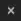

.. note::

    As of version 5.1, importing static meshes with custom collision will also create collision actors in the level for some reason.
    Collision is imported properly.

.. tab-set::
    ..tab-item:: Label1
        Markdown 1

|
Scene Tab
--------------

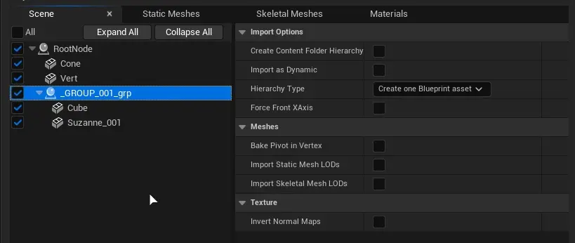

Outline of the scene in source file will be listed on the left side. Outline contains every asset and group contained in source file.

To exclude assets or groups from importing, **untick them in their category. Unticking in scene tab won't change anything**

.. figure:: images/07.webp
    :align: center

    Use expand/collapse buttons to quickly show all assets

.. admonition:: Blender Tip
    :class: tip

    Files imported from blender will not be grouped as blender uses --Collections-- instead.
    
    To create fake groups in blender, parent assets to an empty and name it as you wish. Empties do not have to share same collection as assets.

    While importing :ref:`FbxSceneImportData` asset will be created, which only purpose is to allow reimporting or adding new assets from single source file.

Import Options
''''''''''''''''''

* :ref:`Mesh Import Create Content Folder Hierarchy`
* :ref:`Mesh Import Import as Dynamic`
* :ref:`Mesh Import Hierarchy Type`
* :ref:`Mesh Import Force Front XAxis`

Meshes
''''''''''''''''''

* :ref:`Mesh Import Bake Pivot in Vertex`
* :ref:`Mesh Import Import Static Mesh LOD`
* :ref:`Mesh Import Import Skeletal Mesh LOD`

Texture
''''''''''''''''''

* :ref:`Mesh Import Invert Normal Maps`

|
.. _Importing Assets FBX Static Meshes:

Static Meshes Tab
--------------------

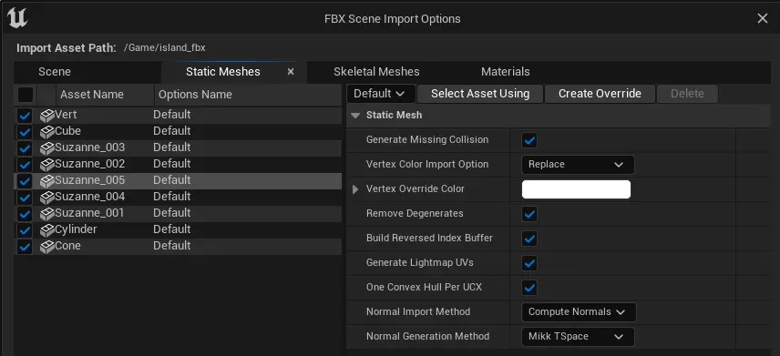

Unticking elements in this tab will exclude them from importing. You can also select multiple meshes and press :kbd:`RightMouseButton` to add or remove them from importing.

Static meshes tab supports :ref:`Mesh Import FBXImport Setting Sets`

**Reimporting**

If window was opened to reimport the file, new and deleted files from source FBX file will be marked with |meshplus| or |meshminus|

Files removed from FBX file will be also removed from Unreal Engine project. In order to not remove them, simply untick them.

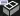

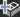

All items
''''''''''''''''''

* :ref:`Mesh Import Generate Missing Collision`
* :ref:`Mesh Import Vertex Color Import Option`
* :ref:`Mesh Import Vertex Override Color`
* :ref:`Mesh Import Remove Degenerates`
* :ref:`Mesh Import Build Reversed Index Buffer`
* :ref:`Mesh Import Generate Lightmap UVs`
* :ref:`Mesh Import One Convex Hull per UCX`
* :ref:`Mesh Import Import Normal Method`
* :ref:`Mesh Import Normal Generation Method`

|
Skeletal Meshes Tab
----------------------

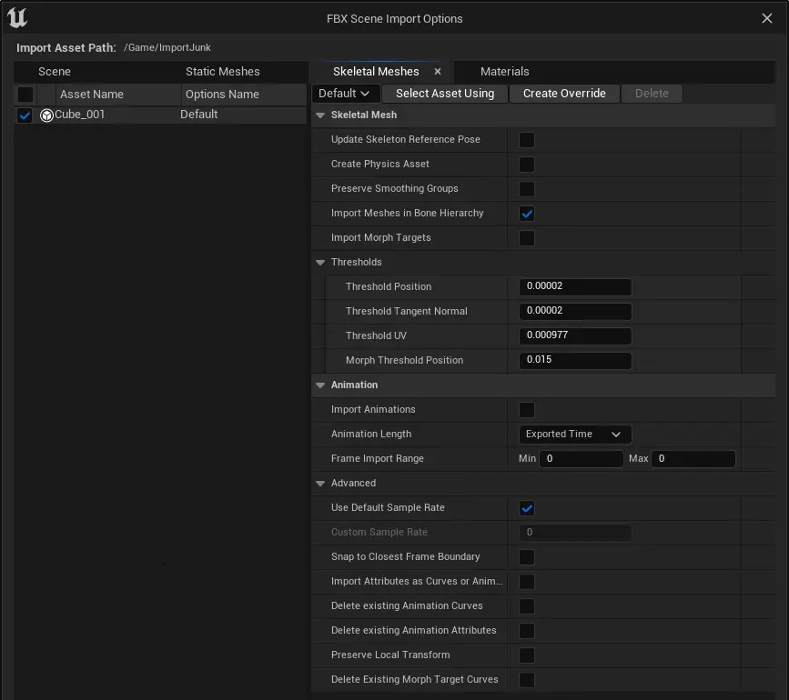

Skeletal meshes tab supports :ref:`Mesh Import FBXImport Setting Sets`

Skeletal Mesh Tab
''''''''''''''''''

* :ref:`Mesh Import Update Skeleton Reference Pose`
* :ref:`Mesh Import Create Physics Asset`
* :ref:`Mesh Import Preserve Smoothing Groups`
* :ref:`Mesh Import Import Meshes in Bone Hierarchy`
* :ref:`Mesh Import Import Morph Targets`
* :ref:`Mesh Import Morph Target Thresholds`

Animation Tab
''''''''''''''''''

* :ref:`Mesh Import Import Animations`
* :ref:`Mesh Import Animation Length`
* :ref:`Mesh Import Frame Import Range`
* :ref:`Mesh Import Use Default Sample Rate`
* :ref:`Mesh Import Snap to Closest Frame Boundary`
* :ref:`Mesh Import Import Attributes as Curves or Animation`
* :ref:`Mesh Import Delete Existing Animation Curves`
* :ref:`Mesh Import Delete Existing Animation Attributes`
* :ref:`Mesh Import Preserve Local Transform`
* :ref:`Mesh Import Delete Existing Morph Target Curves`

Materials Tab
--------------------

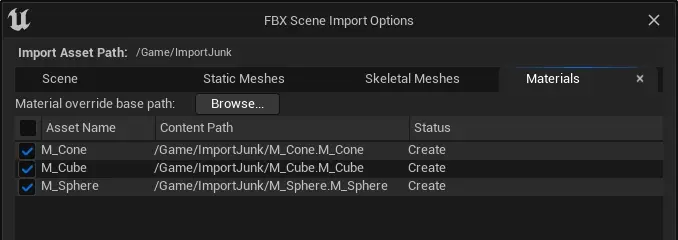

Unticking any material in this tab will exclude it from importing (or deleting if material was deleted from FBX file after previous import to Unreal Engine)

Material path override
''''''''''''''''''''''''

Materials can be imported into different directory. 

All of imported materaials will be placed in one directory. Subdirectories won't be created even when :ref:`Create Content Folder Hierarchy` is ticked in :ref:`Mesh Import FBXImport Static Meshes`

.. _Mesh Import FBXImport Setting Sets:

**Setting Sets**
--------------------

If multiple of static or skeletal meshes share same import settings, you can use Settings Sets to configure importing faster.

Use |fbx_sm_createoverride| and name your new settings set.

After adding a new setting set, press :kbd:`RightMouseButton` on selected static/skeletal meshes and pick new settings set from the context menu.

:kbd:`LeftMouseButton+Ctrl` to select multiple meshes.

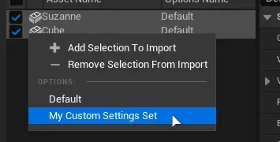

* To select all static meshes using custom settings set, press |fbx_sm_selectassetusing|.
* To remove custom settings set press |fbx_sm_settingsetdelete|
* To preview or modify settings set, but not apply it to the mesh use |fbx_sm_settingsetlist|
* Assets with custom settings set will be marked as |fbx_sm_settingseticon|

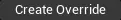

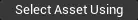

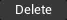

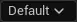

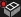

.. _FbxSceneImportData :

FbxSceneImportData 
---------------------------

FbxSceneImportData asset purpose is to provide functionality of reimporting, adding and removing assets from single FBX file.

It is created automatically while :ref:`importing into level <Importing Assets FBX Into Level>`

.. admonition:: Tip
    :class: tip
    
    If :ref:`Create Content Folder Hierarchy` was checked, new folders might not show up in asset browser on reimporting.
    
    Creating these folders manually, using :ref:`Save All` or restarting editor will fix the issue.

.. admonition:: Tip
    :class: tip

    If :ref:`Create Content Folder Hierarchy` was checked, assets might temporarily be visible in asset browser as if this option was unchecked. Refreshing asset browser will fix the issue.
