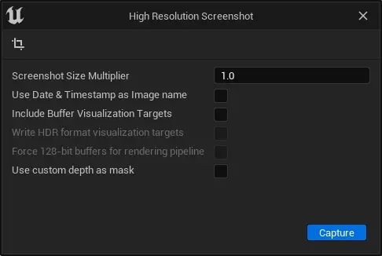
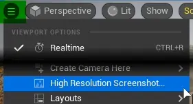
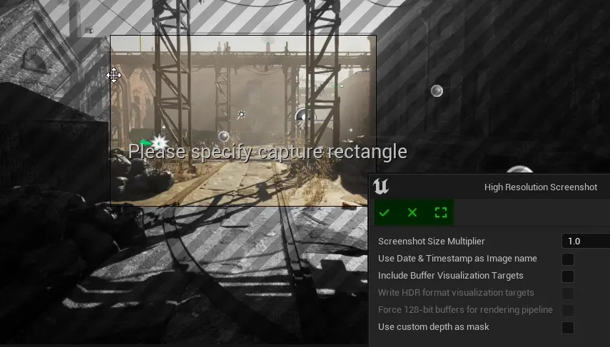
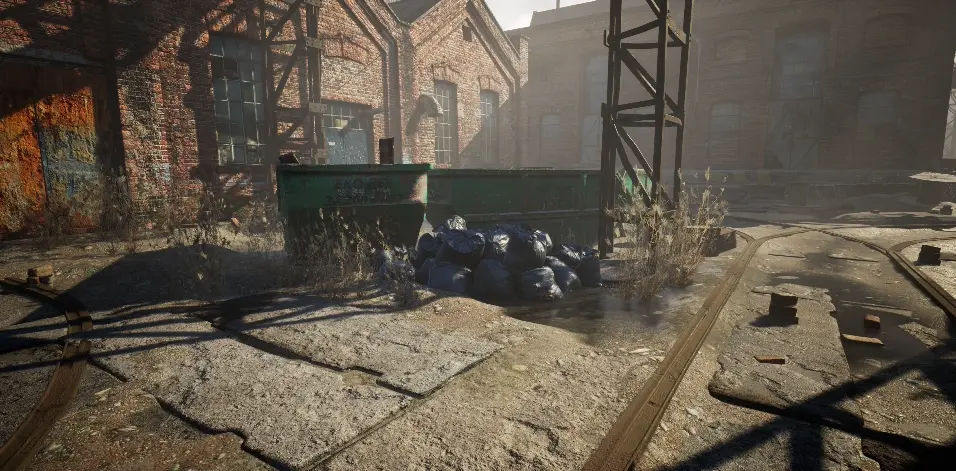
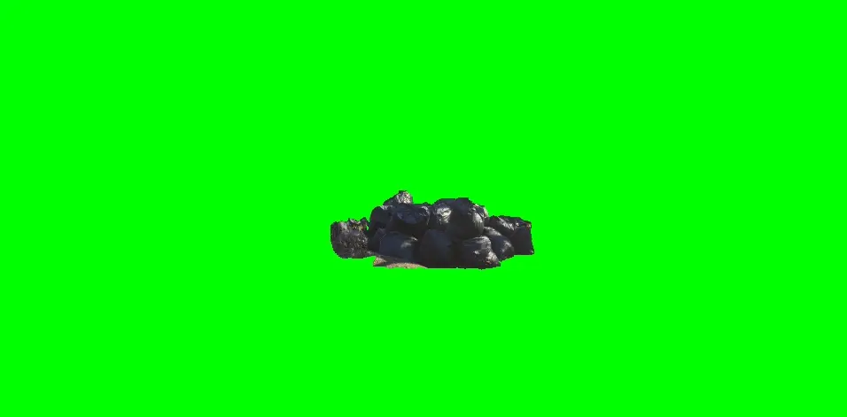

.. _Editor Screenshots:

===============================================================
Screenshots
===============================================================

.. _screenshot:

Simple Screenshot
====================================

To simply create a screenshot press ``[F9]``

.. admonition:: Console Command
    :class: admonition

    .. code-block:: 

        Shot

.. _high_resolution_screenshot:

High Resolution Screenshot
====================================

Use ``High Resolution Screenshot...`` feature to create screenshots of current viewport camera.

Screenshots are saved in project directory: ``..ProjectName\Saved\Screenshots\*platform*Editor``.

Screeshots will be saved in ``.png`` file format, or ``.exr`` if :ref:`write_hdr_visualization_targets` is enabled.

.. admonition:: Console Command
    :class: admonition

    .. code-block:: 
        
        HighResShot
        
| To use this feature in play mode, use console command.

Press |crop_icon| button to select part of the screen that needs to be captured. 

| Use |icon_tick| or  |icon_x| to finish.  
| Use |icon_frame| button to set selection to whole viewport.

.. note::
    
    This is going to capture everything you see right now, including gizmos, icons and editor outlines. Use :ref:`viewport_game_view` (shortcut ``[G]``) or :ref:`viewport_show_menu` to hide specific elements.

Screenshot size multiplier
----------------------------

Simply renders selected area in higher resolution, multiplied by given value. 

Use Date & Timestamp as Image Name
------------------------------------

Examples:

* Disabled: ``HighresScreenshot00000``
* Enabled: ``HighresScreenshot_2022.11.12-22.28.48``

| Console command parameter: ``bDateTimeAsFilename``

.. _include_buffer_visualization_targets:

Include Buffer Visualization Targets
------------------------------------

This feature also saves extra buffer visualizations, like normal or opacity. 

| File names will include suffix, eg ``_LightingModel``.

| Console command parameter: ``bDumpBufferVisualizationTargets``

.. note::

    As of writing of this document, in Unreal Engine 5.0.3, this feature does not work. Use :ref:`write_hdr_visualization_targets` instead.

.. table::
    :width: 100%

    +---------------------------------+
    | Name                            |
    +=================================+
    | BaseColor                       |
    |                                 |
    +---------------------------------+
    | LightingModel                   |
    |                                 |
    +---------------------------------+
    | Metallic                        |
    |                                 |
    +---------------------------------+
    | Opacity                         |
    |                                 |
    +---------------------------------+
    | PostTonerMapHDRColor            |
    |                                 |
    +---------------------------------+
    | PreTonerMapHDRColor             |
    |                                 |
    +---------------------------------+
    | Roughness                       |
    |                                 |
    +---------------------------------+
    | SceneColor                      |
    |                                 |
    +---------------------------------+
    | SceneDepth                      |
    |                                 |
    +---------------------------------+
    | SceneDepthWorldUnits            |
    |                                 |
    +---------------------------------+
    | SeparateTranslucencyA           |
    |                                 |
    +---------------------------------+
    | SeparateTranslucencyRGB         |
    |                                 |
    +---------------------------------+
    | Specular                        |
    |                                 |
    +---------------------------------+
    | SubsurfaceColor                 |
    |                                 |
    +---------------------------------+
    | WorldNormal                     |
    |                                 |
    +---------------------------------+

.. _write_hdr_visualization_targets:

Write HDR Visualization Targets
------------------------------------

This feature works in same way as :ref:`include_buffer_visualization_targets`, but saves final image in 16-bit ``.exr`` format.

| Console command parameter: ``bCaptureHDR``

Force 128-bit buffers for rendering pipeline
---------------------------------------------

[TODO]

Renders screenshot using 128-bit rendering buffers?

Use custom depth as mask
---------------------------------------------

Renders only actors with CustomDepth Pass enabled. See :ref:`render_custom_depth_pass`.

| This does not hide actors in front of the target actor.

| To quickly enable, go to ``Details panel`` of selected actor, and enable ``Render CustomDepth Pass`` under ``Rendering > Advanced``.

| If ``.png`` export is enabled, image will contatin transparent background
| If ``.exr`` export is enabled, background will be green. Use chroma keying in other software to remove it.
