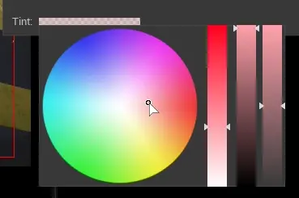

.. _cinematic_viewport_overlays:

Cinematic Viewport Overlays
==============================

Overlays help aligning camera to frame objects and also to apply various `composition rules`_.

.. _composition rules: https://blog.depositphotos.com/back-to-basics-10-composition-rules-in-photography.html

Composition overlays
----------------------

Color of any overlay below can be changed using ``Tint``

Grid 3x3
^^^^^^^^^^^^^^^^^^^^^

.. figure:: 04_Cinematic_Viewport_Overlays/images/18.webp

Grid 2x2
^^^^^^^^^^^^^^^^^^^^^

Crosshair
^^^^^^^^^^^^^^^^^^^^^

Rabatment (Two squares)
^^^^^^^^^^^^^^^^^^^^^^^^

Frames
----------------------

Safe zones
^^^^^^^^^^^^^^^^^^^^^

Some displays might hide area outside of those zones, see for example `overscan`_ or zoom in on video in Youtube on your smartphone.

It's best practice to keep action or text inside of their respectable boxes. 

.. _overscan: https://en.wikipedia.org/wiki/Overscan

.. _safe_zone_color_change:

    Size of those boxes can be modified using percentage sliders.

    
    Color, by clicking under percentage slider.

Letterbox Mask
^^^^^^^^^^^^^^^^^^^^^

Preview letterbox in specified aspect ratio. Color of the mask can be changed by clicking colored area under proportion sliders.

| 16 : 9 is a standard PC or TV screen
| 21 : 9 is a typical ultrawide monitor
| 1.85:1 or 2.39:1 are common aspect ratios used in cinema.
