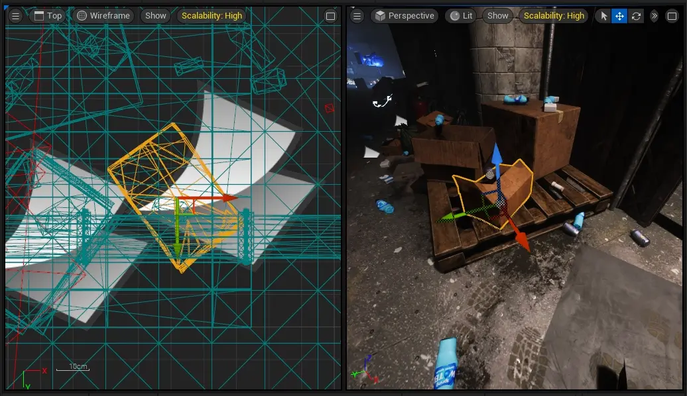
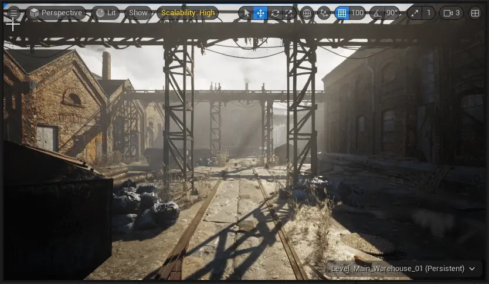
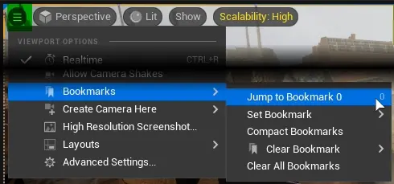
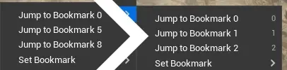
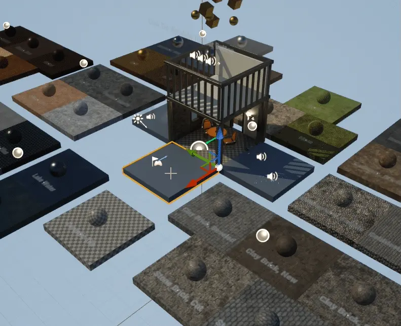
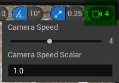
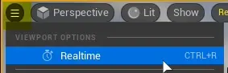
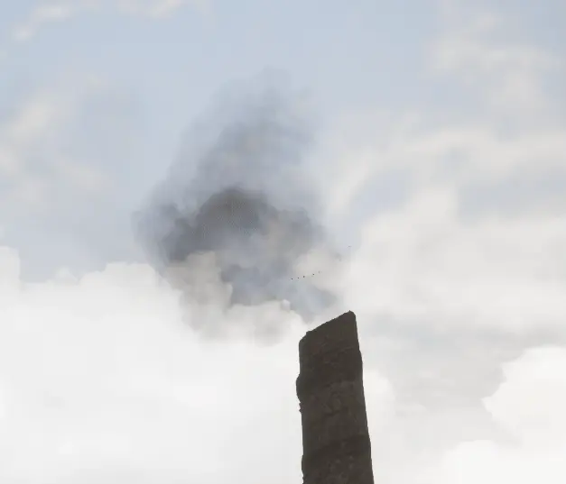

===========================
Viewport Camera
===========================

.. _viewport_camera_types:

Viewport Camera Types
===========================

* Perspective - the default view
* Orthographic - useful for precise actor placement

| Keyboard shortcut
| Keyboard shortcut ``[ALT]`` + ``[G] or [H] or [J] or [K]`` -> Perspective, Front, Top, Left
| ``[ALT] + [SHIFT] + ...`` reverses the orthographic view, eg. Left -> Right

.. _viewport_camera_options:

Viewport Camera Options
===========================

Viewport Camera Field of View (FOV)
-------------------------------------

| Unreal Engine uses Horizontal FOV, hence (H) in title.
| Default value is 90°

Viewport Camera Far View Plane
-------------------------------------

.. figure:: 02_Viewport_Camera/images/05.webp

Far View Plane defines how far does the object need to be from camera to not be rendered.

Useful for large worlds to improve performance.

| Setting value to 0 sets it to Infinite

Viewport Camera Bookmarks
===========================

.. figure:: 02_Viewport_Camera/images/06.webp

Bookmarks save viewport camera location

| Bookmarks are saved into current level.
| Bookmarks are moving the camera in ALL viewport windows.

| Go to bookmark: Any number key from ``[0]`` to ``[9]``
| Set new bookmark: ``[CTRL]`` + Any number key from ``[0]`` to ``[9]``

    You can manage bookmarks in ``Viewport Options`` menu.

``Compact Bookmarks`` simply removes empty slot gaps between saved bookmarks.

Focus camera
===========================

Focus viewport camera on selected actor(s)
--------------------------------------------

Select at least one actor and press ``F``

Change Camera Speed
===========================

Use ``Change Camera Speed`` menu in editor viewport. 

| ``Camera Speed Scalar`` multiplies that value, allowing for more precise or faster camera movement.

Realtime Toggle
===========================

Disabling realtime pauses all animations, physics and particle systems.

| While realtime is off, some windows will report it to the user and viewport toolbar will have extra toggle to turn it on.
| Keyboard shortcut is ``[CTRL] + [R]``

.. note::
    
    While using Simulate or Play, viewport is only updated while viewport camera is moving.

